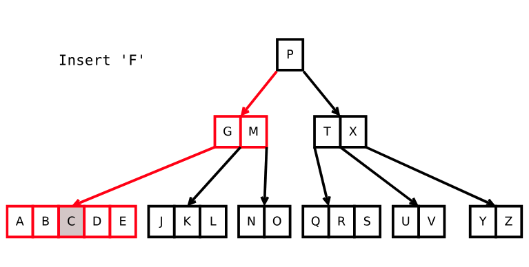
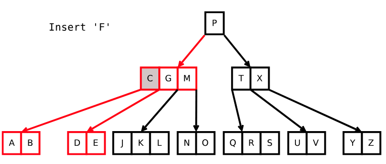
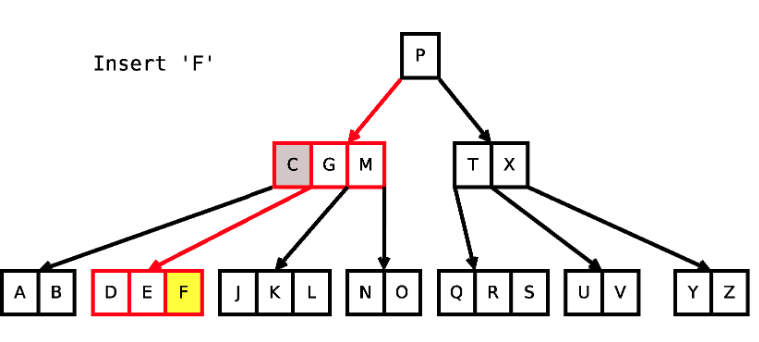
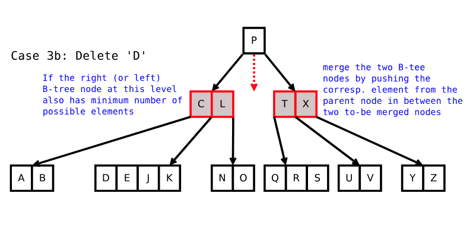
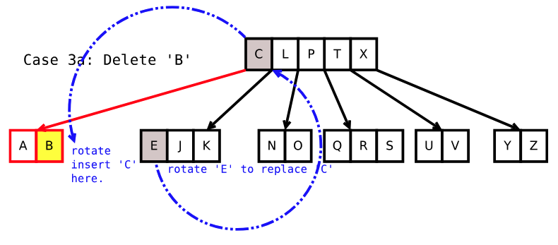

# B-Trees 

### Properties 
- B-trees are a rooted tree  
- All leaves have the same depth from the root 

#### Node structure: 

**Sorted Nature**
- Nodes are stored in increasing sorted order through binary search 
- Each node has an array of: 
    - Elements (`N`)
    - Children (`N+1`)
- Each child's elements are less than the `N+1`th element in a node 

**Minimum degree** 
The minimum degree of a variable is defined as some value `t` - this defines the upper and lower bound:
- Lower Bound: `t-1`
- Upper Bound `2t-1`

Each node (except for the root node) must have at least `t-1` elements and have a maximum of `2t-1`
elements and `2t` subtrees. 

## Search 

Searching a B-tree is very simple it is basically a DFS: 
```
def search(x: int, root: 'Node'): 
    
    idx = binary_search(x, root.elements)

    if idx < len(root.elements) and root.elements[idx] == x
        return True
    
    if root is leaf:  
        return False
    
    return search(x, root.children[idx])
    
```
## Insert 

#### Step 1: Step onto the full node (`len(elements) == upper_bound`) 


#### Step 2: Push the median into the parent node 


#### Step 3: Insert the letter


1) Whenever we step onto a node that exceeds the `upper bound` along the path to insert at a leaf: 

    a) **Case A (Node is a non-root node):** We need to push the median to the parent node 

    b) **Case B (Node is a root node):** We push the median of the current to be the new root node

2) We push this median into the binary searched position and the LHS and RHS elements are moved to either
sides of that element in the parents children array. 
3) The children are also split along with the median but maintain their relative positions in the array 

## Delete 

### Case 1: 
- Deleting at a leaf node that has `>t-1` elements 
- Just delete at the leaf node with no repercussions 

### Case 2: Deleting at an Internal Node

Define the element we want to delete as `x`

#### Case 2A: Left child node of `x` has at least `t` elements
**In-order predecessor:** Largest element in the left subtree  
- Delete and replace `x` with the in-order predecessor 

#### Case 2B: Right child node of `x` has at least `t` elements
**In-order successor:** Smallest element in the right subtree  
- Delete and replace `x` with the in-order successor  

#### Case 2C: Left and Right child nodes of `x` both do not have at least t elements
1) Pull down `x` and append all RHS elements to the LHS elements  
2) If children, append all RHS children to the LHS children
3) Continue to delete `x` $\rightarrow$ all other cases 

### Case 3: Step on a node that has `t-1` elements 

- **Always check 3B before 3A**

#### Case 3B:

1) Check if RHS has `t-1` elements 
2) Check if LHS has `t-1` elements 
3) If either one has `t-1` elements merge `LHS + median + RHS`
3) Continue to delete `x` $\rightarrow$ all other cases 

#### Case 3A: 

**Immediate Successor** - The RHS siblings smallest element 

**Immediate Predecessor** - The LHS siblings largest element

##### Right rotation:



1) Check RHS if `>t-1`: (Right Rotation)
    1) Replace median with the immediate successor 
    2) Append target node with the median 
    3) Delete the immediate successor from the RHS
        - If the RHS sibling was an internal node, append the leftmost child to the target node


2) Check LHS if `>t-1`: (Left Rotation)
    1) Replace median with the immediate predecessor
    2) Prepend element with the median 
    3) Delete the immediate predecessor  from the LHS
        - If the LHS sibling was an internal node, prepend the right child to the target node
