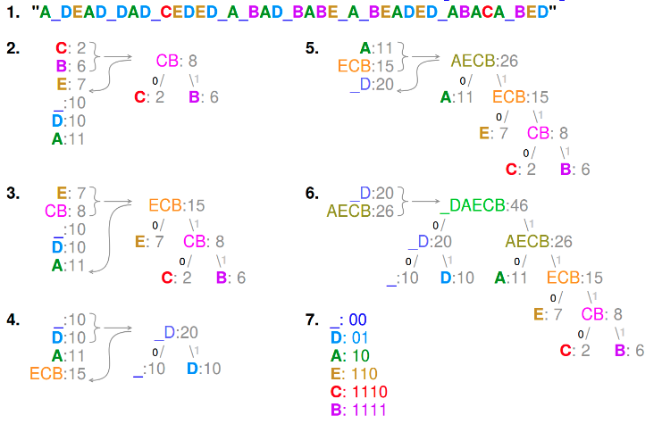
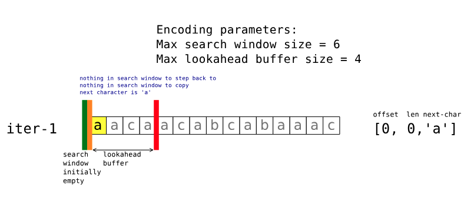
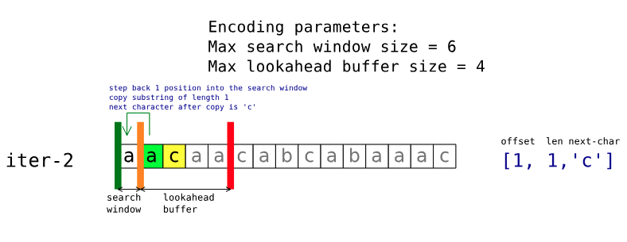
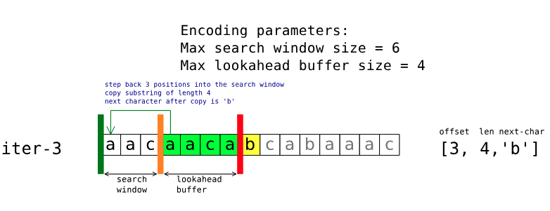
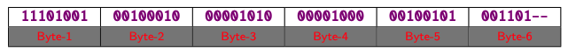
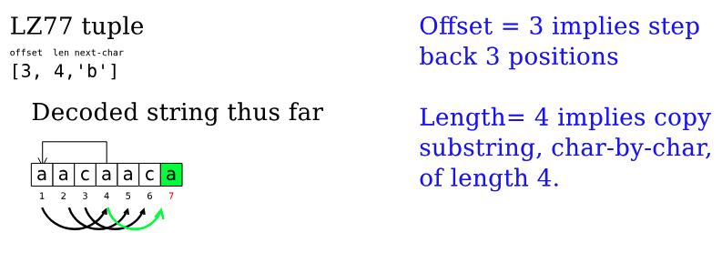
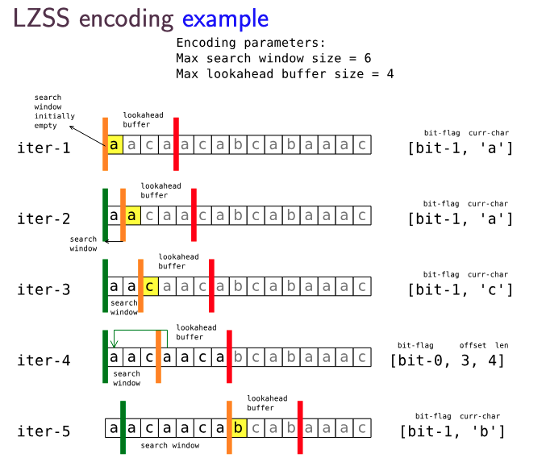

# Huffman Encoding (strings) 

## Prefix-free code

**Prefix-free:** means that no symbols code word is a prefix of another symbols code word. 

This is important in Huffman encoding. Since no code word is a prefix of another, as we move through the 
bit stream, we can instantly match each code word to its corresponding character as soon as its complete.
This means that each match is unique and immediate. 

## Algorithm 



```
def HuffmanEncoding(string): 
    
    Count and sort all the letters of the string by frequency 
    Queue(char, frequency)

    while merged not together 
    
        Merge first 2 elements in the Queue to form binary tree 
        Add merged string back onto the Queue

    dfs(binary tree) - get each path to the leaf nodes 
    # each path is the codeword for a letter

    for letter in string; 
        replace letter with code word
```

```
def HuffmanDecoding(bitstream): 
    
    curr = '' 
    res = ''
    
    for bit in bitstream: 
        curr.append(bit)
        
        if curr matches any symbols codeword: 
            res.append(symbol)
            curr = ''
    
    return res  
```

# Elias Omega (Integers)

## Minimal binary code 
**Minimal binary code word:** is the binary representation of a number such that the most significant 
bit is always 1. 

## Why is the Elias Omega encoding important?

In computers, data is sent as a stream of bits. If we used a fixed length binary encoding for every 
number even small numbers would be represented as:

`0000000000000000000000000000000000000000000000000000000000000001`

So to avoid this, Elias Omega represents numbers in a minimal binary form with extra bits to ensure 
that each encoded number can be uniquely identified. This ensures that we use only as many bits as 
needed to represent each number used, making communication and storage more efficient. 

## Algorithm 

```
def EliasOmegaEncoding(num): 
    
    res = binary(num)
    N = len(binary(num)) - 1 
    num = binary(N)

    while N > 1: 
        flip leading bit of num to 0 
        res = num + res 

        N = len(num) - 1 
        num = binary(N)

    return res 
```

```
def EliasOmegaDecoding(bitstream): 
    
    readlen = 1 
    component = ""
    pos = 1 
    
    while leading bit == 0
        component = codeword[pos:pos+readlen-1]
        flip first bit 
        pos = pos + readlen 
        readlen = convert component to dec + 1
    
    component is the number 
    return component to decimal 
    
```

# LZ77 Algorithm 

This is a sliding window algorithm which has 3 regions defined by 2 regions:

- Search window/dictionary (between pointers `i` and `j`)

- Lookahead buffer/buffer (between pointers `j` and `k`)

This algorithm compares strings from the lookahead buffer to the search window to determine the encoding of triplets. These triplets have the format: 

```
(offset, length, char)
```

**offset:** How many places we need to step back from `j` to start our match from the buffer to 
the search window 

**length:** The length of characters we need to copy from the offset

**char:** The next character if the lookahead buffer, after the matched char/substring

## Encoding

### Initialisation: 
Must define the `lookahead buffer size` and `Max search window size`:

- `i` and `j` are pointers starting from 1 
- `j = i + lookahead_buffer`

### Iteration: 
1) Compare substrings in the `lookahead buffer` to the substrings in the `search window`

    a) Case a: 
        No matches $\rightarrow$ `(0, 0, first char in the lookahead buffer)`
        
        
    b) Case b: 
        Matches $\rightarrow$ `(offset, length, first char in the lookahead buffer)`
        

**Note** Matches can also 'bleed' past the pointer `j` into the lookahead buffer for matches. 
Shown below: 



2) Once matches are recorded we need to move the pointers: 

- `j` moves past the previous `next-char`
- `i` only moves to maintain the `max search window` (if greater than threshold move to maintain
`max search window size`)
- `k` moves to maintain the `max lookahead buffer size`

### Termination: 
- When `j = k` we terminate the algorithm.
- At the end of iteration we should have a series of triplets:
```
- [0,0, 'a']
- [1,1, 'c']
- [3,4, 'b']
- [3,3, 'a']
- [1,2, 'c']
``` 
**IMPORTANT:** All of numbers are encoded using Elias Omega whilst the letters are encoded using 
Huffman encoding, this makes each of the triplets more compact.  

```
- [0,0, 'a'] → 111
- [1,1, 'c'] → 01001001
- [3,4, 'b'] → 000100000010100
- [3,3, 'a'] → 000100000010001
- [1,2, 'c'] → 01001101
```

All of these can then be packaged into bytes of important for decoding:



## Decoding

```
def decode_LZ77(bitstream): 
    
    decode into triplets again 
    
    # triplet is (offset, len, next_char)
    
    for all triplets: 
        step back by offset 
        from offset copy sequential chars len times 
        append next_char to the end
    
```



# Extension: LZSS Algorithm

LZSS algorithm makes a small improvement on the LZ77 algorithm by encoding triples differently

- Format 1 (tuples): $matched_substring< \delta$ 
    - `[bit-flag 1, curr_char]`

- Format 2 (triplets): $matched_substring\geq \delta$ 
    - `[bit-flag 0, offset, len]`



**DECODING** is fundamentally the same just that you directly append the `Format 1` tuples.
