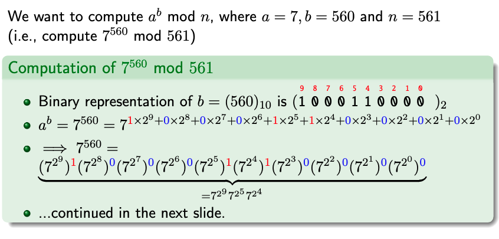
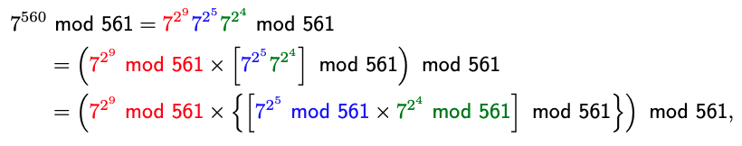
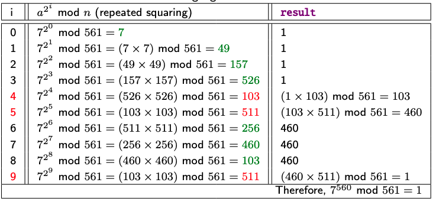

# Algorithms involving large integers 

## Integer Multiplication 

### Naive Method $O(N^2)$
To multiply 2 `d` digit numbers we use long multiplication this is a $O(D^2)$ time algorithm. This is 
because we have to multiply each digit from $num_1$ with each digit from $num_2$. 

### Karatsuba's Algorithm $O(N^{log_2(3)})$

- This is a divide and conquer algorithm. 


Assume that we have 2 2d-bit numbers: 
- Can pad these numbers to make them even length  

$$
u = 2^d * U_1 + U_0 
$$

$$
v = 2^d * V_1 + V_0 
$$

Therefore the product of $u * v$

$$
uv = 2^{2d} U_1 V_1 + 2^d(U_0 V_1 + U_1 V_0 ) + U_0 V_0  
$$

$$ 
= 2^{2d} U_1 V_1 + 2^d(U_0 V_1 + U_1 V_0 + U_0 V_0 - U_0 V_0 + U_1 V_1 - U_1 V_1) + U_0 V_0
$$

$$ 
= 2^{2d} U_1 V_1 + 2^d(U_1 V_1 - (U_1 - U_0)(V_1 - V_0) + U_0 V_0) + U_0 V_0
$$

$$
= (2^{2d} + 2^d)U_1 V_1 - 2^d (U_1 - U_0)(V_1 - V_0) + (2^d + 1) U_0 V_0
$$

This now means that we have 3 `d`-bit multiplications: 
1) $U_1V_1$
2) $(U_1 - U_0)(V_1 - V_0)$
3) $U_0V_0$

This motivates the thinking behind karatsuba's multiplication algorithm: 
1) Keep recursively splitting the 3 `d`-bit multiplications until numbers are small enough for direct 
multiplication (`d=1`)
2) Then propogate solution back up the recursive stack by substituiting the 3 multiplications into the 
final equation. 

## Modular Exponentiation 

### Divisibility & Divisors 

#### Division Theorem  
For any integer `a` and any positive integer `n`, there exists unique integers `q` (quotient) and 
`r` (remainder) such that `a = qn + r` where $0\leq r < n$

**Quotient:** $q = \lfloor \frac{a}{n} \rfloor$

**Remainder:** $a * mod(n) = r$

**Congruence Class:** 2 integers are in the same congruence class if they have the same remainder 
$$
a \equiv b \mod (n)
$$ 

$$ 
a \mod n = b \mod n 
$$

### Modular Exponentiation $a^b mod(n)$

#### Repeated Squaring 

1) Represent `b` in binary


2) Use $x * y mod(z)= (x mod(z) * y mod (z))mod(z)$ to expand expression 


3) Evalute using $2^{i} = (2^{i-1}mod(z) * 2^{i-1}mod(z))mod(z)$


## Primality Testing 

#### Primality 
- A natural number greater than 1 that has: 
    - No positive divisors/factors other than 1 and itself 

**Asymptotic distribution of prime numbers:** $\pi(n) \approx \frac{n}{In(n)}$
- This means that the average probability that a randomly chosen large number near `n` is prime 
is approximately $\frac{1}{\ln(n)}$

#### Trial Division 
Test everything in range `n` to see if it can divide, if can't then it should be prime.
```
def naive_test(n): 
    for k in range(2, n): 
        if (n mod(k) == 0) return "Composite"
    return "Prime"
```

Complexity $O(\sqrt n * d^2)$ why?

If a number has a factor other than 1 or itself, at least one of those factors $\leq \sqrt n$

So...
1) $O(N)$ number of divisions 
2) For an interger division we have `d` bits representing the binary length 
3) $\rightarrow O(d^2 * N)$ - division is a quadratic operation 
4) If a number has a factor other than 1 or itself, at least one of those factors $\leq \sqrt n$
5) Therefore, `N` is bound by $\sqrt n$
6) $O(\sqrt n * d^2)$

### Fermats Little Theorem 

If `p` is prime, then for any integer `a`, $a^{p} - a$ is an integer multiple of `p`

Alternatively: 
$$
a^p \equiv a \mod(p)
$$
 And, if we divide by $a$
$$
a^{p-1} \equiv 1 \mod(p)
$$

**IMPORTANT:** This is a necessary test: 
- If fails then definately composite 
- Else probably prime 
    - If passes but not technically prime $\rightarrow$ **pseudo-primes**

### Miller Rabin 

Miller Rabin primality testing is a stricter extension to FLT based on 2 modifications 
1) Several randomly chosen values of `a` 
2) Uses key observations that reduces the chance of falsely calling a 'composite' number as a 
'probably prime'

These observations are: 
1) If `n` is an odd number then `n-1` is even and can always be represented as 
$$
n - 1 = 2^s * t , \quad t \quad is \quad odd \quad \geq 1
$$

