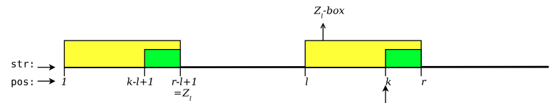
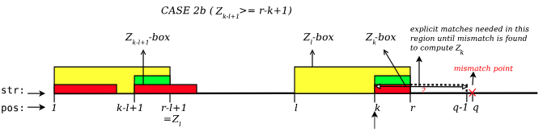
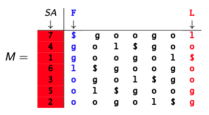
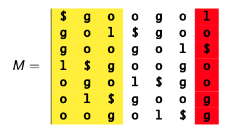

## Naive Pattern Matching 
The idea is that we slide the pattern over the text checking over every single `i` within the text 
versus every character of the pattern. The complexity of this is $O(M\times N)$ where `M` is `len(pat)` and `N` is
`len(text)`. 


## Gusfield's Z Algorithm 
On the fundamental level the Z algorithm finds the Z values of a string in linear time, $O(N)$ where `N` is 
`len(pat)`
#### Z-Values ($Z_{i}$)
The Z-values for a string is the length of the longest substring starting at a position i within `string[1..n]`
that matches the prefix of the entire string. $Z_{1}$ is relatively redundant only because it is the start of 
the string and would by default fully match the length of the string. 

#### Z-Boxes | $L_{i}$ and $R_{i}$ Values 

**Z-Box**: 
For a string `str[i...n]` ($i>1$ and $Z_{i} > 1$)
a Z-Box at index `i` is an interval $[i...i+Z_{i}-1]$ which captures the longest prefix match starting at 
index `i`.  

**$l_{i}$ and $r_{i}$**: 

1) $r_{i}$ is the right-most endpoint of all `Z-boxes`  that begin at or before position `i`. 

2) $l_{i}$ is the left end of a `Z-box` that ends at $r_{i}$. 
If there are mulitple `Z-boxes` ending at $r_{i}% then the $l_{i}$ can be any one from those `Z-boxes`

### Base Case
1) Compute $Z_{2}$ by explicitly comparing `str[2...n]` to `str[1..n]` until a mismatch is found. 

2) After a mismatch is found: 
    
    1) If $Z_{2} > 0$: 
        
        1) Set `r` to $Z_{2}$ 
        
        2) Set `l` to 2 
    2) $Z_{2}$ == 0:
        
        1) Set `l` and `r` to 0

### Case 1 $(k>r_{i})$
Where $k>r$, meaning that the $Z_{k}$ value we are computing lies on position `k` and it lies **outside** of the 
previous $r_{i}$ value. In this case we MUST perform **explicit** comparisons to compute $Z_{k}$. 

1) Explicitly compare characters from the prefix `str[1...q-k]`  with position `k` `str[k...q-1]` until a 
mismatch is found at some $q \geq k$. 
 
    1) $Z_{k} > 0$: 
        1) `r` is set to the `q-1` (Character before the mismatch `q`)
        2) `l` is set to position `k` (Starting position)
    2) $Z_{k} == 0$:
        1) Do not update `l` or `r` values as they will retain the same values as before. 
    
### Case 2 $(k \leq r_{i})$
Given the inductive nature of the `Z Algorithm`, the overarching idea of case 2 is that we are using previously
computed `Z-boxes` to inform our current `Z-box` calculation. 


The idea here is that because the 2 yellow regions are the same, we can assume that the both green regions exist
and are also the same, this informs the way in which we process case 2. 

#### Case 2a 
This is where the `Z-box` at position `k` does not extend past the $r_{i}$ value - meaning that the entire `Z-box`
lies within the 'outer' `Z-box`. 
To then set the 'inner' `Z-box` we infer from the previously computed `Z-box` to determine the `Z-box` at position`k`. 

1) Set $Z_{k}$ to $Z_{k-l+1}$ (the `Z-box` within the prefix)
2) `r` and `l` remain unchanged. 

#### Case 2b 
Case 2b occurs where both $Z_{k-1+1} \geq r-k+1$ and $k \leq r_{i}$. From the diagram, this means that the 
difference between position `k` and `r` must be smaller than the $Z_{k-l-1}$ value. 

In this case it means that 
we have a situation where can inductively infer that what is bound by the `Z-box` at `l` and position `1` is the 
same up to their respective `r` values but we cannot guarantee that what is outside the `r` values is perfectly
the same. This means that we need to perform explicit comparisons



In this case, we must: 

_Assume that in this case outside of the `Z-boxes` we have a mismatch at some position `q`_
1) Set $Z_{k} = q-k$
2) Set $r = q-1$
3) Set $l = k$ 

### Linear Time Complexity Proof 

#### Time Complexity

The linear time complexity of the Z Algorithm is due to Case 2a and 2b, which 'looks back' at 
`Z-boxes` computed on the prefix allowing us to compute the current `Z-box` inductively. This means that each 
character in the string is examined only twice: 
1) Initial extension of the `Z-boxes` in the base case and case 1
2) 'Looking back' on the previously computed `Z-boxes` on the prefixes to determine future Z boxes
This is accumulated to an overall **Linear time Complexity**

#### Space Complexity 
- A $Z_{i}$ Array is stored which is $O(N)$ space complexity 
- `l` and `r` pointers are stored in $O(1)$ time 

## Boyer-Moore 

The main idea of Boyer-Moore algorithm is that you are directly comparing the pattern with the text, but you are
performing 'safe shifts' as to avoid missing instances of the pattern on the text. 
Boyer-Moore is a linear time algorithm due to the 4 key methods: 
1) Right-to-left scanning 
2) Bad Character rule 
3) Good Suffix 
4) Galil's optimisation 

Boyer-Moore takes the maximum between the 2 Bad character or Good Suffix rule to define a well-defined 
optimal shift. 

### Right-to-left scanning 
This backwards scanning offers no performance benefits in comparison to the left-to-right scanning. 
However, the direct allows us to enable both the **bad character rule** and the **good suffix rule**

### Bad Character & Extended Bad Character rule 
The concept of the bad character rule is that when we mismatch a character at `k` we shift the pattern to 
match the next occurence of `k` within the pattern. 

##### Bad Character rule 
1) $R(x)$ is the rightmost occurence of each character that appears in the pattern. 
2) We perform shifts $k-R(x)$, where `k` is the current position that we are comparing on the pattern  

- **Case 1: $k-R(x) > 0$**: In this case we shift $k-R(x)$ places to the right. This is where the right most occurence 
of `x` is on the left hand side of `k`
- **Case 2: $k-R(x) \leq 0$**: This means that the rightmost occurence of the character `x` is on the right 
hand side of `k`, this means that we just shift by 1 (naively).
- **Case 3: $R(x) == 0$**: This means that `x` does not lie within the pattern - we can safely shift 
the entire pattern past the mismatch character, meaning that we will shift `k` positions. 

##### Extended Bad Character rule 
1) $R_{k}(x)$ is the right most occurence of each character at position `k` in the pattern. 
2) We now only perform $k-R_{k}(x)$ to determine how many positions we want to shift. 

At this stage, we do right-to-left comparisons until we reach a 'bad character', from here we 
determines its $R_{k}(x)$ value and then subtract it from position `k` (position on the pattern that mistmatched 
with the bad character) to define our bad character shift.  

### Good Suffix Rule 
The idea of the Good Suffix rule is to determine if we can perform a greater safe shift than what is defined by 
the bad character rule. The core of the Good suffix rule lies between these 3 values. 

##### $Z_{i}^{suffix}$
This is the longest substring of pattern that matches the suffix of the pattern. 
This is calculated by: 
1) `string = reversed(pat) + $ + pat` - note that the delimiter must not appear in the pattern `$` is just use here as a placeholder. 
2) $Z_{i}^{suffix}$ = `Gusfield's-Z-Algorithm(string)`
3)  $Z_{i}^{suffix}$[`len(pat)`::] - This slices off the unwanted reversed prefix 

##### Good suffix Value
The good suffix value `gs[i]` is how far you can safely shift the pattern when a mismatch occurs at position `i`. 
This is calculated by: 
1) Initialising an array of `len(pat)+1` to `0`
2) For each index from `1` to `len(pat)+1`
    1) `pos = len(pat) - Z_suffix[p] + 1` - this allows us to compute how much to shift at index `j`
    2) `gs[j] = p `

##### Match Prefix  
the matched prefix value is the longest suffix of `pat` that matches the prefix of `pat`
the pattern. 
This is calculated by running Gusfield's Z algorithm on the pattern. 
1) `Gusfield's-Z-Algorithm(pat)`

#### Good Suffix Cases 
1) `k` represents the index on the pattern that we have hit a mismatch 

##### Case 1a: 
If at some `pat[k]` we hit a mismatch and `gs[k+1] > 0`: 

- Shift `pat` by `m-gs[k+1]` places 

In this situation we are looking for other instances of the suffix that was matched up to `k` and trying to align them
with what we have previously matched on the text 

##### Case 1b  
If a mismatch occurs at some `pat[k]` and `gs[k+1] = 0`]: 

- Shift `pat` by `m-mp[k+1]`

In this situation, if we cannot find other instances of the suffix within the pattern, then we try to at least 
match the prefix of pattern to what was previously matched. 

##### Case 2  
If we find an instance of `pat` on the `text`: 

- Shift `pat` by `m-mp[2]`

Because we have fully matched, we want to find the furthest prefix that matches the existing position, this 
allows us to perform the greatest 'safe shift'. 

### Galils optimisation 

Galils optimisation uses 2 pointers `start` and `stop` on the pattern which allows us define areas that we have already compared. 
This allows us to guarnatee a linear time complexity. 

#### Case 1: 
If `gs[k+1]>0` (Case 1a - matching to a suffix within the pattern): 

    - `start = gs[k+1] - m + k + 1` 
    - `stop = gs[k+1]` 

`start` is set to the start of the suffix that is guaranteed to match in the next iteration. 

`stop` is set to the end of the suffix that we have shifted and previously compared on the pattern. 

#### Case 2: 

**ELSE** we just set: 
- `start` = 1 
- `stop = mp[k+1]`

## Burrows Wheeler Transform 



Notable components of the `BWT` cyclic permutation matrix: 
- `L` the `BWT` output 
- `F` the first column containing the sorted characters of the original text 

To form `L`, you substract 1 from the indexes within the suffix array `SA` to create the `L` column
in `M`. 

To get the columns within a `BWT` cyclic permutation matrix: 
- Moving left: subtract 1 from the previous column
- Moving right: adding 1 from the previous column 

**Disclaimer:** if the index is out of range or negative we 'wrap' around to the first or last column.

### Properties of a BWT 

For a `BWT` transformation of a string `str[1..n]` its sortes cyclic permutation matrix will be also 
called `M`(`L` and `F` are noted as the last and first columns): 

1) Any column of `M` is a permuation of `str[1...n]` 
2) Any successive columns of `M` give the permutations of all **k-mers** in `str[1...n]`
3) Since `M` is a matrix of sorted permutations, the `L` precedes `F`
4) `BWT(s)` is invertible - this means that we can reconstruct the original string `str[1...n]` from 
`BWT(s)`

**Disclaimer 1:** A `k`-mer are substrings that are of length `k` 

**Disclaimer 2:** $BWT^{-1}$ is used to denote the inverse of a `BWT` transformation

### Naive BWT Construction 



1) Start with `str[1...n]` and then sort lexicographically
2) Given that `M` is a cyclical permutation matrix... 
    1) We increment the indexes of the letters of `L` appending rows on `M` to fill out the array. 

Make sure to keep track of the letters indicies as these must be taken into account. 

#### This is highly inefficient...
Let `N` be the length of `str[1...n]`: 

- Space complexity $O(N^2)$ - Must store each operation in the permutation matrix
- Time complexity $O(N^2)$ - Operation is performed for each space in the cyclical permutation matrix

### $BWT^{-1}(BWT(S))$ using L-F mapping

Given the cyclical order of `M` we are able understand what `char` in `F` maps to `L`. 

For any letter `x` defined by `L[i] = 'x'` in the `BWT(S)` column, we can find `str[1..n]` using 
the formula: 

`pos = Rank(x) + nOccurrences(x, L[1..i))`

`Rank(x)` is the position of where `x` first appears in `F`

`nOccurrences(x, L[1...i))` is the number of times `x` occurs in `L[1...i)` 
- More specifically, `nOccurrences(x, L[1...i))` means how many times `x` has appeared in the index
up to the previous position 

##### Pseudo Code: 

```
string = ''
x = '$'
i = 1 

For _ in range(len(BWT(S))): 
    pos = Rank(x) + nOccurrences(x, L[1..i))
    char = BWT(s)[pos]
    string.append(char)
    i = pos 

return reversed(string)
    
```

### Multiplicities

`BWT` is used to find patterns within in a a very very large text. Especially if the patterns are very 
frequently occuring in the text and very short. 

**Pseudo Code** $O(M)$

```
sp = 1 
ep = len(pat)

For char in reversed(string): 
    ep = rank(char) + nOccurrences(char, L[1...ep])
    sp = rank(char) + nOccurrences(char, L[1...sp))

multiplicities = ep - sp 

indexOfOccurrence = []

for i in range(sp, ep): 
    index = SA[i]
    indexOfOccurrence.append(index)

return multiplicities, indexOfOccurrence
```

